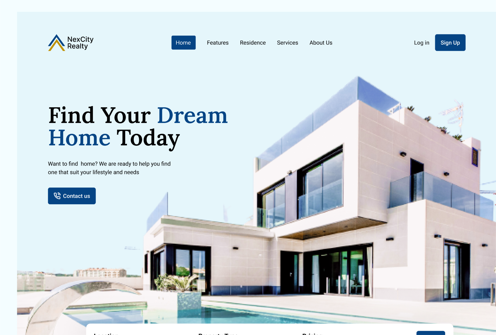

# 🌐 Portfolio - Adeyemo Taiwo M.



Welcome to the official repository of my personal portfolio. I am **Adeyemo Taiwo M.**, a **Frontend Developer & UI Designer** dedicated to building functional, user-friendly, and visually stunning web experiences that solve real-world business problems.

## 🚀 Overview

This project is a high-performance, responsive portfolio website built with modern web technologies. It showcases my skills, selected projects, and my professional approach to design and development.

## ✨ Features

-   **Dynamic Hero Section:** Engaging introduction with smooth animations.
-   **Project Showcase:** A curated list of projects like **NexCity Realty**, **ClassFundz**, and more.
-   **Skill Visualization:** Interactive display of frontend and design tools.
-   **Dark/Light Mode:** Full support for both themes with a smooth transition.
-   **Responsive Design:** Optimized for all devices (Mobile, Tablet, Desktop).
-   **Contact Integration:** Seamless contact form powered by EmailJS.
-   **Micro-animations:** Enhanced UX using GSAP and Framer Motion.
-   **Cursor Glow:** Interactive radial gradient background that follows the cursor.

## 🛠 Tech Stack

### Frontend
-   **Framework:** [Next.js](https://nextjs.org/) (React)
-   **Styling:** [Tailwind CSS v4](https://tailwindcss.com/)
-   **Animations:** [GSAP](https://greensock.com/gsap/), [Framer Motion](https://www.framer.com/motion/)
-   **Icons:** [React Icons](https://react-icons.github.io/react-icons/)
-   **Lottie:** [DotLottie](https://lottiefiles.com/dotlottie)

### Tools & Others
-   **Design:** Figma, Photoshop
-   **Forms:** React Hook Form
-   **Email Service:** EmailJS
-   **Version Control:** Git & GitHub

## 📂 Project Structure

```text
├── public/          # Static assets (images, icons, PDFs)
├── src/
│   ├── app/         # Next.js App Router (pages & global styles)
│   ├── assets/      # Project data and SVG assets
│   ├── components/  # Reusable UI components
│   ├── contexts/    # Context API for state management (Theme, Mode)
│   ├── sections/    # Main sections of the landing page
│   └── ui/          # Atomic UI elements (Buttons, Badges, etc.)
├── tailwind.config.js
└── package.json
```

## 🛠 Getting Started

### Prerequisites
-   Node.js (Latest LTS version recommended)
-   npm or yarn

### Installation

1.  **Clone the repository:**
    ```bash
    git clone https://github.com/adeyemo-taiwo-m/atm.git
    cd atm
    ```

2.  **Install dependencies:**
    ```bash
    npm install
    ```

3.  **Set up Environment Variables:**
    Create a `.env.local` file in the root directory and add your EmailJS credentials (if applicable):
    ```env
    NEXT_PUBLIC_EMAILJS_SERVICE_ID=your_service_id
    NEXT_PUBLIC_EMAILJS_TEMPLATE_ID=your_template_id
    NEXT_PUBLIC_EMAILJS_PUBLIC_KEY=your_public_key
    ```

4.  **Run the development server:**
    ```bash
    npm run dev
    ```
    Open [http://localhost:3000](http://localhost:3000) with your browser to see the result.

## 📈 Selected Projects

-   **NexCity Realty:** A modern real estate web app for property management.
-   **ClassFundz:** A fund management system for university students.
-   **Car Configurator:** An interactive 3D-like car customization project.

## 🤝 Let's Connect

I'm always open to discussing new projects, creative ideas, or opportunities to be part of your vision.

-   **Email:** [adeyemotaiwo.m@gmail.com](mailto:adeyemotaiwo.m@gmail.com)
-   **LinkedIn:** [linkedin.com/in/adeyemo-taiwo](https://linkedin.com/in/adeyemo-taiwo)
-   **GitHub:** [github.com/adeyemo-taiwo-m](https://github.com/adeyemo-taiwo-m)

---

Developed with ❤️ by **Adeyemo Taiwo M.**
